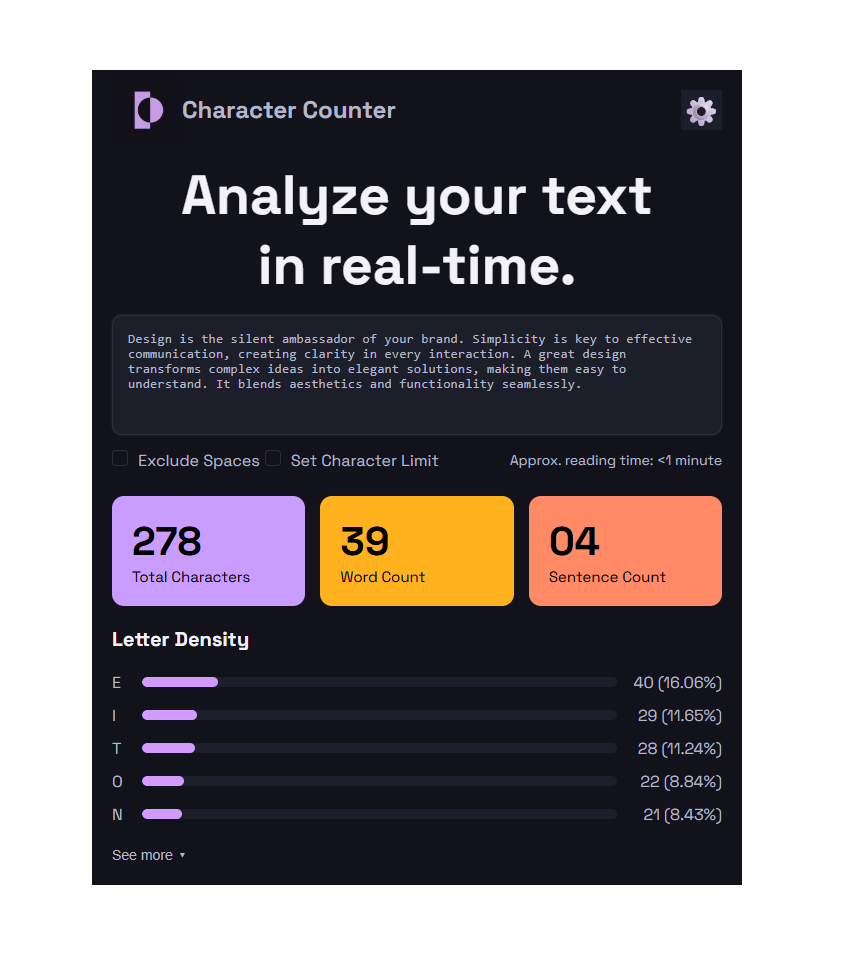

# Proyecto de Maquetado Web – Character Counter (HTML + CSS)

## 1. Objetivo del proyecto
El objetivo principal del proyecto fue replicar la interfaz visual de un contador de caracteres y analisis de texto en tiempo real, usando solamente HTML para la estructura y CSS para estilar.

---

## 2. Tecnologías utilizadas
* **HTML5:** Para la estructura semántica del contenido.
* **CSS3:** Para el diseño visual.

---

## 3. Organización del HTML
Intenté organizar el HTML de la manera mas sensilla y limpia posible, lo dividi en 5 secciones:
* `<header>`: Puse el logo del sitio y el titulo en h1, ya que creo que al ser el titulo del proyecto, tiene la mayor jerrquia, a pesar de ser chico que otro texto, con css le di el tamaño correcto. Y tambien tiene un boton de configuracion la derecha, que aun no tiene funcionalidad, mas adelante podrá servir por ejemplo para seleccionar idioma o cambiar de modo oscuro a claro.
* `<section hero>`: Contiene la consigna principal del proyecto y el elemento `<textarea>` configurado para el ingreso de texto.
* `<section controls>`: Contiene los checkbox personalizados y el tiempo estimado de lectura.
* `<section cards>`: Tiene las tres tarjetas de métricas (Total Characters, Word Count y Sentence Count), haciendo de manera visible los resultados del analisis.
* `<section letter-density>`: Contiene la barra de densidad de letras. Cada fila agrupa de forma independiente la letra correspondiente, la barra contenedora y la información de porcentaje.

---

## 4. Cómo se resolvió el CSS
* **Variables CSS (`:root`):** Se definió una serie de colores (colores de fondo, textos, tarjetas) para facilitar el mantenimiento del css.
* **Maquetado con Flexbox:** Use `display: flex` en el `header`, `controls`, `cards` y en `.row` para lograr alineaciones perfectas.
* **Barras de Progreso Personalizadas:** Para el apartado Letter Density, con ayuda de chat-gpt, opté por una solución basada en divs (bar y fill). El contenedor `bar` posee flex: 1 para ocupar el centro del espacio disponible, mientras que el elemento interno `fill` determina el progreso visual mediante un porcentaje estático asignado.
* **Estilos de Inputs Propios:** Quité los estilos nativos de los checkboxes con `appearance: none` para poder personalizar mi propio checkbox, haciendo que el fondo sea oscuro y que aparezca el tilde al seleccionar. Use la ayuda de chat-gpt para lograr el resultado.
* **Estética visual:** Aplique bordes redondeados (`border-radius`) a algunos componentes y una leve sombra (`box-shadow`) para el `textarea`.

---

## 5. Dificultades encontradas
* **Checkbox:** La parte de css fue bastante dificil, ya que el checkbox default es bastante feo, y tuve que estilizarla mucho para que quede bien.
* **Cards:** Me costó asignarle el backround-image que queria a cada una de las cards, al final la deje conun fondo liso y quedo bien.
* **Letter-density:** Fue una seccion que me costo bastante, ya que no sabia como hacerla, con ayuda de chat-gpt fui entendiendo y haciendo paso a paso, tanto en HTML como en CSS.

---

## 6. Capturas del resultado final

Aqui dejo la captura de pantalla del resultado final, creo que me quedo bastante parecido y creo haber cumplido el objetivo, aunque se que podría mejorar algunas cosas, sobre todo para hacerlo responsive en un futuro.

